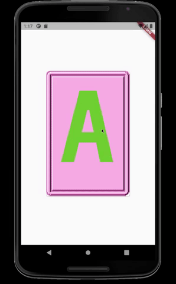

# meis_game

A small flash card game for my daughter Mei.

## About

Since all of the phone apps geared for babies are littered with ad's and/or cost an excessive amount of money, I decided to put together a simple app to let my daughter swipe through flash cards (and possibly photos).

## Status

After about a week of slowly testing what Flutter/Dart can do, I have finished the original idea I had for this app, which was to make a simple flash card game. The app is still a little rough around the edges, but I will be slowly fixing it up until I can get it to a more acceptable state and adding some number flash cards. Once the app looks a little more visually appealing, I will be working on adding a few more features to give the app a more complete feel.

## How to Use

- If you want to run this app on your device, follow [these](https://flutter.dev/docs/get-started/install "Flutter | Install") installation instructions from the official Flutter website. I suggest using VSCode for simplicity.
- Once installed, download this repo and use your desired tool (command line, ide) to run Flutter apps. A phone or tablet will give best results, but this app will run in the browser or on an emulator.
